<h1 align="center">Labecommerce-Backend</h1>

<div align="center">

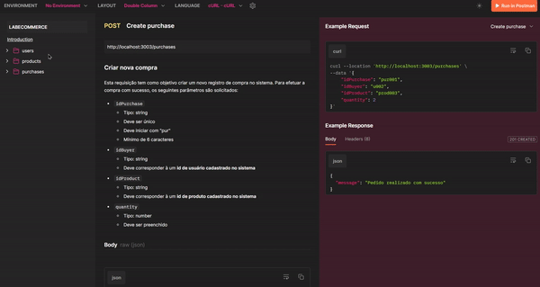

Clique [**AQUI**](https://documenter.getpostman.com/view/28316385/2s9YCBsofL#038765ca-c528-4237-a382-6730cdccb12c) para conferir o resultado final da API!

<p align="center">
<br>
  <a href="https://skillicons.dev">
    
  </a>
</p>
<p align="center"><strong>Status do Projeto:<br></strong>Concluído ✔</p>

</div>

## Índice

-   [1. Resumo do Projeto](#1-resumo-do-projeto)
-   [2. Ferramentas e Tecnologias Utilizadas](#2-ferramentas-e-tecnologias-utilizadas)
-   [3. Instalação](#3-instalação)
-   [4. Inicialização](#4-inicialização)
-   [5. Endpoints](#5-endpoints)
    -   [Get all users](#get-all-users)
    -   [Create user](#create-user)
    -   [Get all products](#get-all-products)
        -   [Funcionalidade 1](#funcionalidade-1-➡-get-all-products)
        -   [Funcionalidade 2](#funcionalidade-2-➡-get-product-by-id)
    -   [Create product](#create-product)
    -   [Edit product by id](#edit-product-by-id)
    -   [Create purchase](#create-purchase)
    -   [Get purchase by id](#get-purchase-by-id)
    -   [Delete purchase by id](#delete-purchase-by-id)
-   [6. Tratamento de Erros](#6-tratamento-de-erros)
-   [7. Lista de requisitos do projeto](#7-lista-de-requisitos-do-projeto)
-   [8. Desenvolvedora](#8-desenvolvedora)

## 1. Resumo do Projeto

[🔼](#índice)

Este é o primeiro projeto do Módulo Backend do Bootcamp da Labenu.

É um projeto de API que gerencia **usuários**, **produtos** e **compras**. O projeto define diversos endpoints para realizar operações de CRUD (Create, Read, Update, Delete).

## 2. Ferramentas e Tecnologias Utilizadas

[🔼](#índice)

Este projeto foi construído com:

-   **NodeJs**
-   **Typescript**
-   **Express**
-   **SQL**
-   **SQLite**
-   **Knex**
-   **Postman**

## 3. Instalação

[🔼](#índice)

### Pré-requisitos:

Ter instalado o `node.js` e o `npm` .

### Instalações necessárias:

```bash
npm install
```

## 4. Inicialização

[🔼](#índice)

Para rodar o servidor localmente digite o seguinte comando:

```bash
npm run dev
```

## 5. Endpoints

[🔼](#índice)

Clique [aqui](https://documenter.getpostman.com/view/28316385/2s9YCBsofL#038765ca-c528-4237-a382-6730cdccb12c) para visualizar a documentação da [API LABECOMMERCE](https://documenter.getpostman.com/view/28316385/2s9YCBsofL#038765ca-c528-4237-a382-6730cdccb12c).

A base URL para esta API é **`http://localhost:3003`**

Os endpoints estão divididos em pastas de acordo com o que é gerenciado.
A API fornece os seguintes endpoints para interagir com usuários, produtos e compras:

<div align="center">

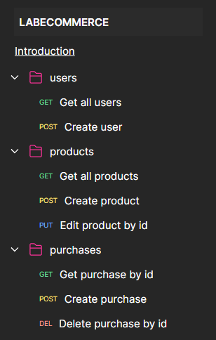

</div>

### `Get all users`

[🔼](#índice)

-   **Método HTTP:** GET
-   **Descrição:** Recupera uma **lista** de todos os usuários cadastrados no sistema.
-   **Exemplo:**

    ```json
    // Request:
    // GET http://localhost:3003/users

    // Response:
    // status 200 OK
    [
        {
            "id": "u001",
            "name": "Amanda",
            "email": "amanda@gmail.com",
            "password": "Amanda@123!",
            "createdAt": "16-10-2023 11:47:50"
        },
        {
            "id": "u002",
            "name": "Layla",
            "email": "layla@gmail.com",
            "password": "Layla@123!",
            "createdAt": "16-10-2023 12:01:22"
        }
    ]
    ```

-   **Response - Postman:** <br>

    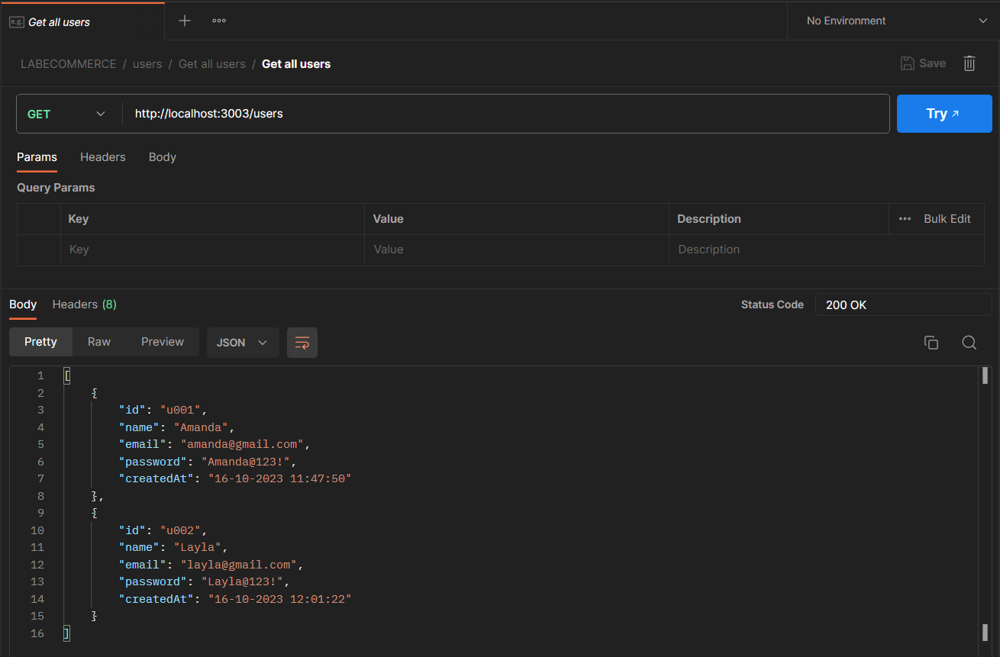

---

### `Create user`

[🔼](#índice)

-   **Método HTTP:** POST
-   **Descrição:** Cria um novo usuário e cadastra no sistema.
-   **Exemplo:**

    ```json
    // Request:
    // POST http://localhost:3003/users
    // body JSON
    {
    "id": "u003",
    "name": "Verity",
    "email": "verity@gmail.com",
    "password": "Verity@123!"

    }

    // Response:
    // status 201 CREATED
    {
        "message": "Cadastro realizado com sucesso"
    }
    ```

-   **Response - Postman:** <br>
    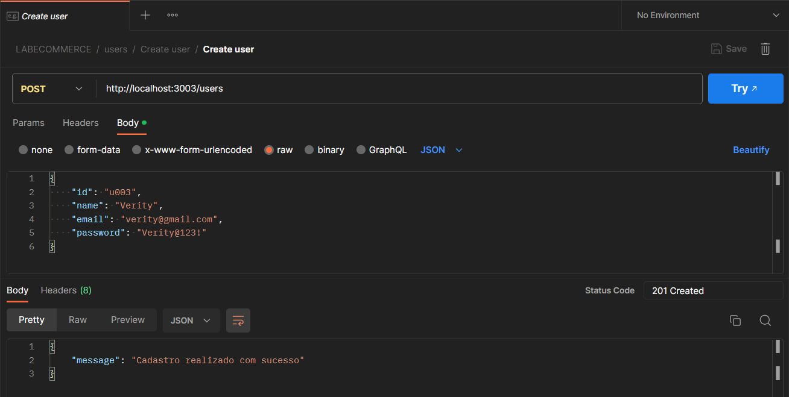

---

### `Get all products`

#### **Funcionalidade 1** ➡ `Get all products`

[🔼](#índice)

-   **Método HTTP:** GET
-   **Descrição:** Recupera uma lista de todos os produtos cadastrados no sistema.
-   **Exemplo:**

    ```json
    // Request:
    // GET http://localhost:3003/products

    // Response:
    // status 200 OK
    [
        {
            "id": "prod001",
            "name": "Amazon Echo Dot",
            "price": 529,
            "description": "O Amazon Echo Dot é seu assistente pessoal que torna sua vida mais conveniente.",
            "imageUrl": "https://m.media-amazon.com/images/I/61-lJAEa4oL._AC_SY300_SX300_.jpg"
        },
        {
            "id": "prod002",
            "name": "Teclado Mecânico Premium",
            "price": 1600,
            "description": "Experimente a excelência em digitação com o Teclado Mecânico Premium. Conforto e durabilidade incomparáveis.",
            "imageUrl": "https://m.media-amazon.com/images/I/51blOqa0fQL._AC_SL1000_.jpg"
        }
    ]
    ```

-   **Response - Postman:** <br>
    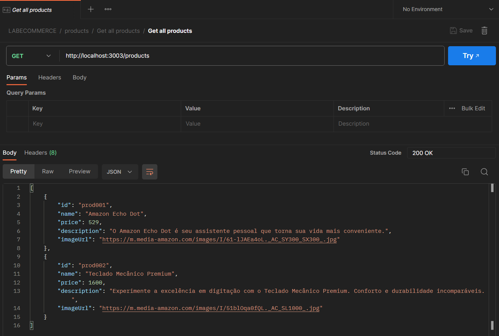

---

#### **Funcionalidade 2** ➡ `Get product by id`

[🔼](#índice)

-   **Método HTTP:** GET
-   **Descrição:** Caso seja informado uma query params(_name_), irá retornar os produtos que contenham o '_name_' informado em seu nome.
-   **Exemplo:**

    ```json
    // Request:
    // query params = name
    // GET http://localhost:3003/products?name=teclado

    // Response:
    // status 200 OK
    [
        {
            "id": "prod002",
            "name": "Teclado Mecânico Premium",
            "price": 1600,
            "description": "Experimente a excelência em digitação com o Teclado Mecânico Premium. Conforto e durabilidade incomparáveis.",
            "imageUrl": "https://m.media-amazon.com/images/I/51blOqa0fQL._AC_SL1000_.jpg"
        }
    ]
    ```

-   **Response - Postman:** <br>
    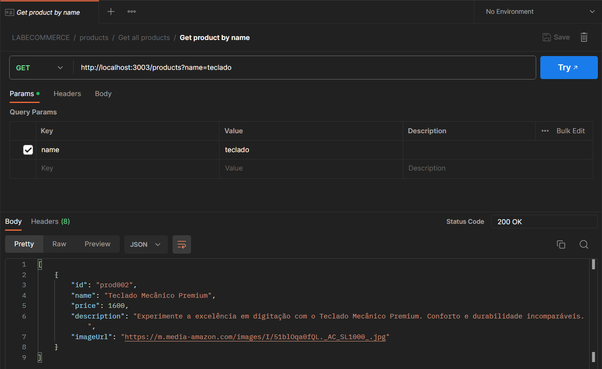

---

### `Create product`

[🔼](#índice)

-   **Método HTTP:** POST
-   **Descrição:** Cria um novo produto e cadastrada no sistema.
-   **Exemplo:**

    ```json
    // Request:
    // POST http://localhost:3003/products
    // body JSON
    {
    "id": "prod003",
    "name": "Webcam",
    "price": 350,
    "description": "Webcam 1200hd",
    "imageUrl": "http2.mlstatic.com/D_NQ_NP_997539-MLU71052328588_082023-O.webp"
    }

    // Response:
    // status 201 CREATED
    {
    "message": "Produto cadastrado com sucesso"
    }
    ```

-   **Response - Postman:** <br>
    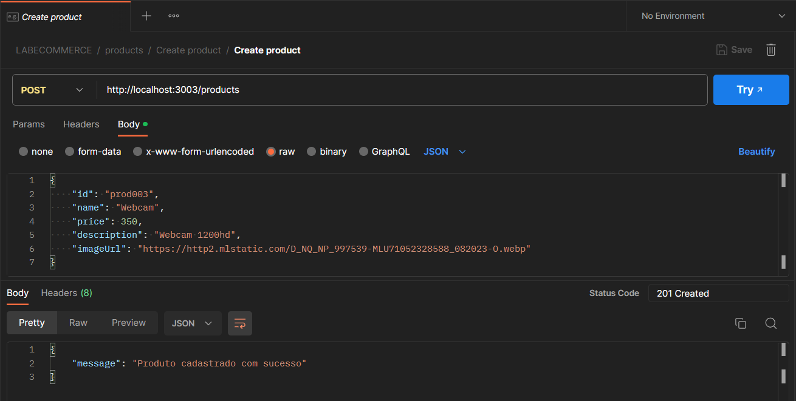

---

### `Edit product by id`

[🔼](#índice)

-   **Método HTTP:** PUT
-   **Descrição:** Edita um produto com base no seu id e salva no sistema.
-   **Exemplo:**

    ```json
    // Request:
    // path params = :id
    // PUT http://localhost:3003/products/prod003
    // body JSON
    {
        "name": "Webcam Rose",
        "price": 400,
        "description": "Webcam Full HD 1080p com microfone"
    }

    // Response:
    // status 200 OK
    {
        "message": "Produto atualizado com sucesso"
    }
    ```

-   **Response - Postman:** <br>
    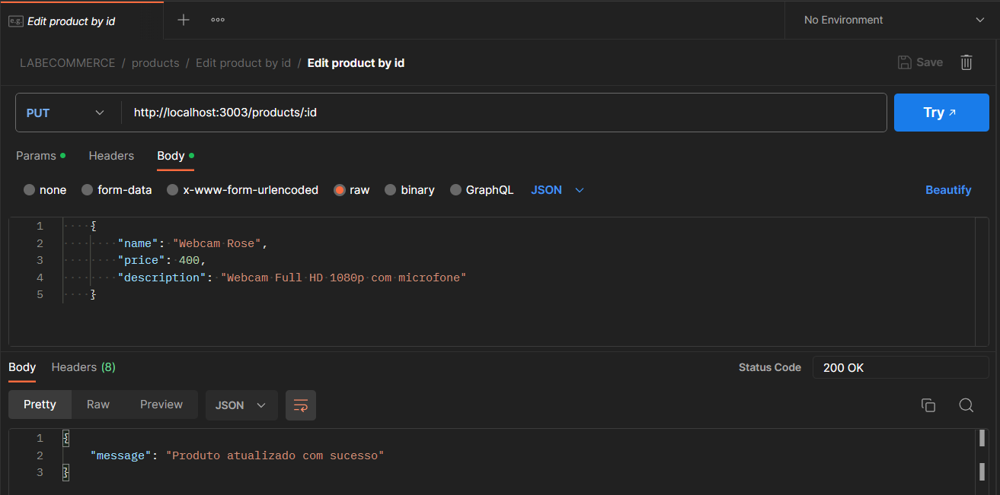

---

### `Create purchase`

[🔼](#índice)

-   **Método HTTP:** POST
-   **Descrição:** Cria uma nova compra e cadastrada no sistema.
-   **Exemplo:**

    ```json
    // Request:
    // POST http://localhost:3003/purchases
    // body JSON
    {
        "idPurchase": "pur001",
        "idBuyer": "u002",
        "idProduct": "prod003",
        "quantity": 2
    }

    // Response:
    // status 201 CREATED
    {
        "message": "Pedido realizado com sucesso"
    }
    ```

-   **Response - Postman:** <br>
    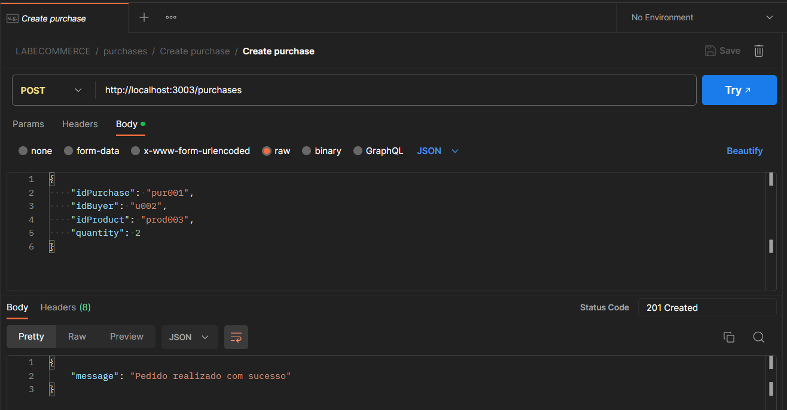

---

### `Get purchase by id`

[🔼](#índice)

-   **Método HTTP:** GET
-   **Descrição:** Retorna uma compra cadastrada no sistema de acordo com o id fornecido.
-   **Exemplo:**

    ```json
    // Request
    // path params = :id
    // GET http://localhost:3003/purchases/pur001

    // Response
    // status 200 OK
    {
        "purchaseId": "pur001",
        "buyerId": "u002",
        "buyerName": "Layla",
        "buyerEmail": "layla@gmail.com",
        "totalPrice": 800,
        "createdAt": "16-10-2023 12:51:28",
        "products": [
            {
                "id": "prod003",
                "name": "Webcam Rose",
                "price": 400,
                "description": "Webcam Full HD 1080p com microfone",
                "imageUrl": "https://http2.mlstatic.com/D_NQ_NP_997539-MLU71052328588_082023-O.webp",
                "quantity": 2
            }
        ]
    }
    ```

-   **Response - Postman:** <br>
    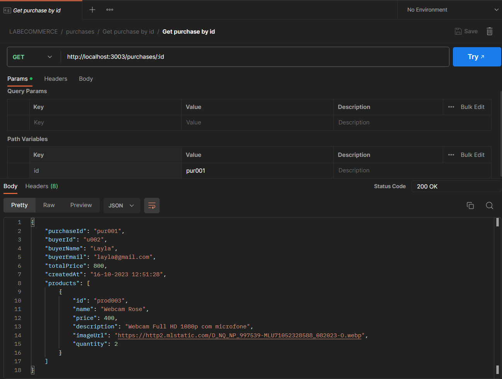

---

### `Delete purchase by id`

[🔼](#índice)

-   **Método HTTP:** DELETE
-   **Descrição:** Deleta uma nova compra cadastrada no sistema.
-   **Exemplo:**

    ```json
    // Request:
    // path params = :id
    // DELETE http://localhost:3003/purchases/pur002

    // Response:
    // status 200 OK
    {
        "message": "Pedido cancelado com sucesso"
    }
    ```

-   **Response - Postman:** <br>
    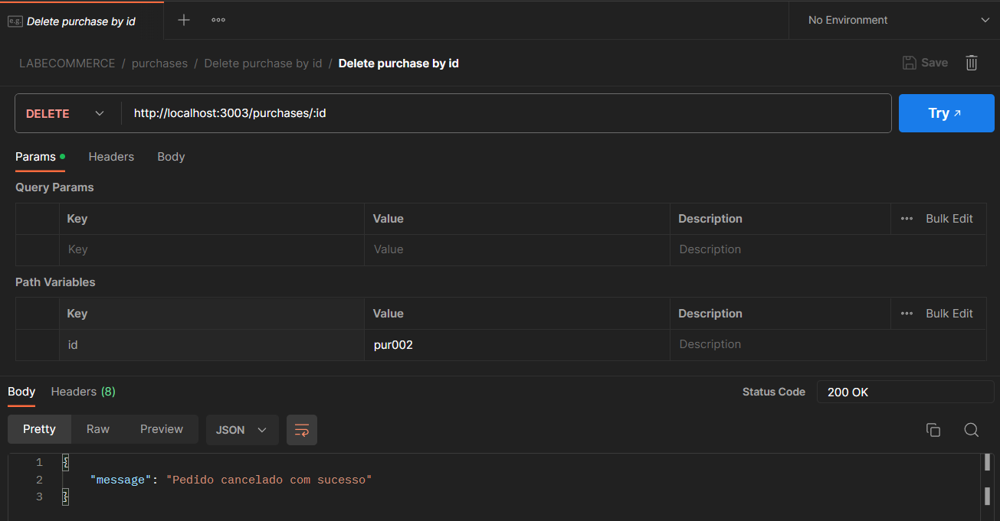

---

## 6. Tratamento de Erros

[🔼](#índice)

A API inclui tratamento de erros para lidar com várias situações, como validação de entrada, IDs duplicados e outros erros comuns. Isso garante que a API responda com mensagens de erro adequadas e status HTTP apropriados quando ocorrem problemas.

## 7. Lista de requisitos do Projeto

[🔼](#índice)

-   [ ] Estruturar os dados como planejado:

    -   [ ] O banco de dados deve possuir as tabelas e colunas conforme o diagrama;
    -   [ ] As requisições também devem respeitar o que é esperado, você pode confirmar as estruturas vendo os exemplos de cada endpoint;
    -   [ ] Garanta que tanto o body, quanto a resposta e seu status estejam de acordo com o que foi planejado.

-   [ ] Implementar os Endpoints :

    -   [ ] Get all users
    -   [ ] Create user
    -   [ ] Create product
    -   [ ] Get all products funcionalidades 1 e 2
    -   [ ] Edit product by id
    -   [ ] Create purchase
    -   [ ] Delete purchase by id
    -   [ ] Get purchase by id

-   [ ] Documentação no Postman de todos os endpoints (obrigatória para correção)

    -   [ ] Descrevendo os endpoints e colocando os exemplos de respostas

-   [ ] Criar o arquivo README.md , explicando seu projeto com prints das respostas

## 8. Desenvolvedora

[🔼](#índice)

Este projeto foi desenvolvido por:

**Amanda Polari** : [LinkedIn](https://www.linkedin.com/in/amandapolari/) | [GitHub](https://github.com/amandapolari)
